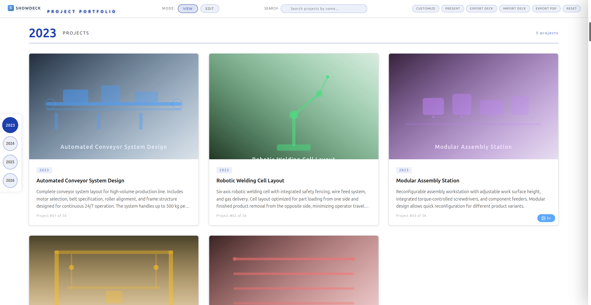
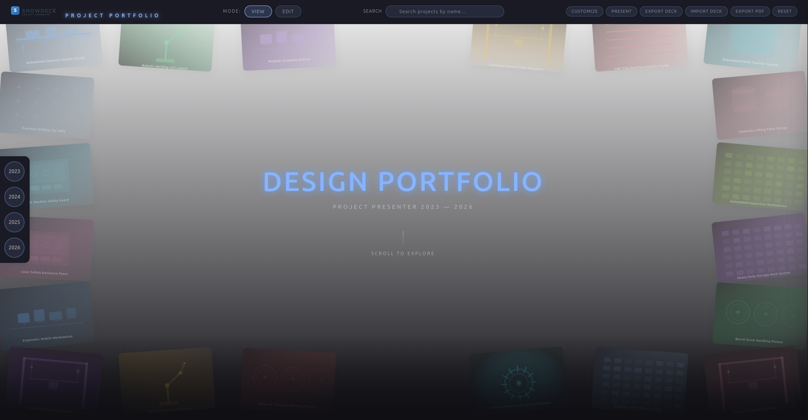
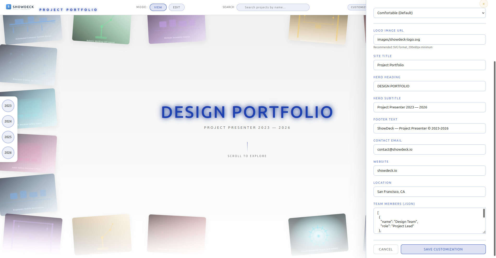
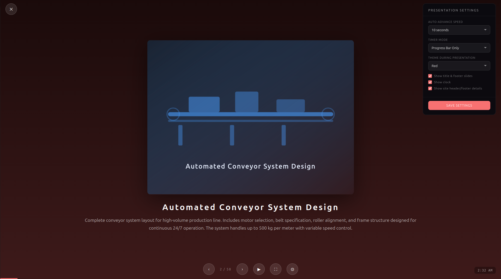
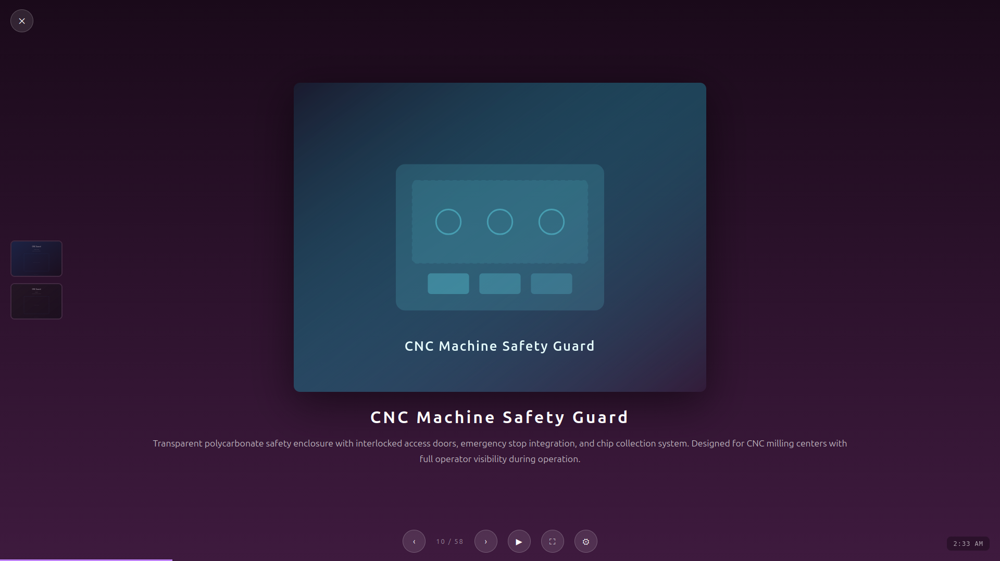
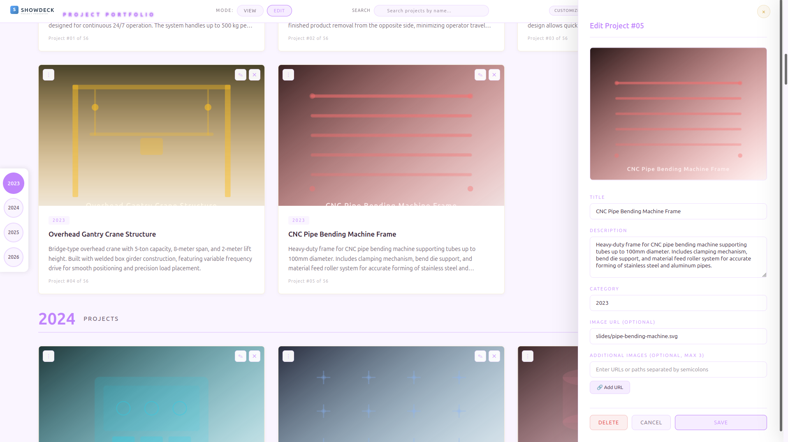

# ShowDeck — Project Presenter

Live Demo :https://gadathegod.github.io/ShowDeck/

A single-file, zero-dependency portfolio and presentation tool for showcasing engineering and design projects. Open it in a browser, customize it, and present — no build step, no server, no node_modules.

---

## What Is ShowDeck?

ShowDeck is a polished, interactive HTML page that displays a curated gallery of projects. Each project card shows a thumbnail, title, category, and description. Clicking a card opens a lightbox viewer with full details and any additional images. You can switch themes, change fonts, adjust layout density, reorder cards by dragging, and enter fullscreen presentation mode with auto-advance.

Everything is stored in `localStorage` inside your browser — no database, no backend.

## Who Is It For?

- **Engineers and designers** who want a clean portfolio to share with colleagues or clients
- **Project teams** who need a quick way to present multiple projects in a meeting or review
- **Students** building a capstone or thesis portfolio
- **Anyone** who wants a beautiful, self-hosted project showcase without setting up a server

## Requirements

- **A modern web browser** — Chrome, Firefox, Edge, or Safari (latest versions)
- **No server required** — just open `index.html` in your browser
- **No build tools** — no `npm install`, no webpack, no compile step
- **Internet connection** (optional) — fonts load from Google Fonts CDN; images can be local SVGs or remote URLs
- **Basic file editing** — to add projects, edit descriptions, or change images you only need a text editor (VS Code, Notepad++, etc.)

That's it. That's all.

JUST DOWNLOAD FROM GITHUB -> LOOK FOR "CODE" GREEN ICON ->DOWNLOAD AS ZIP THE REPOSITORY->EXTRACT IN YOUR LOCAL SYSTEM-> START RUNNING INDEX.HTML AND VOILA !.
---

## Screenshots

### Default Gallery View



The landing page shows a hero collage at the top with project thumbnails fanned out, followed by a categorized gallery of all projects.

### Dark Theme



Switch to dark mode for reduced eye strain during evening reviews.

### Light / Projector Theme



The light theme uses high-contrast black-on-white for maximum visibility on projection screens and whiteboards.

### Green Theme



### Purple Theme



### Edit Mode



In edit mode, each card displays drag handles, edit and delete buttons for managing projects.

---

## Quick Start

1. Open `index.html` in your browser
2. You'll see your project gallery with the hero collage at the top
3. Click **Edit** in the top bar to enter edit mode
4. Click **Customize** to change the logo, title, theme, and more
5. Click **Present** to start a fullscreen slideshow

## Project Data

All project data lives in `projects_data.js`. It exports a single array called `PROJECTS`. Each project object has this shape:

```javascript
{
  id: 1,
  title: "Project Title",
  description: "Detailed description of the project.",
  category: "2023",
  slide_image: "slides/conveyor-system.svg",
  additional_images: ["images/detail-1.svg", "images/detail-2.svg"]  // optional, max 3
}
```

### Editing Projects via the File

Open `projects_data.js` in your editor and modify the `PROJECTS` array directly. Each object is one project. The `category` field is used for grouping and filtering — projects with the same category are shown together.

### Editing Projects via the UI

1. Click **Edit** in the top bar to enter edit mode
2. Each card now shows edit (pencil) and delete (X) buttons in the top-right corner
3. Click the **pencil** to open the edit panel — change title, description, category, main image, and add up to 3 additional images
4. Click the **X** to delete the project
5. Click the **drag handle** (six dots) on any card to reorder it by dragging
6. Click the big **+** button at the bottom-right to add a new project
7. All changes are saved to `localStorage` automatically

### Editing Site-Wide Settings

Click **Customize** in the top bar to open the site customization panel. You can change:

| Setting | What it does |
|---------|-------------|
| **Theme** | Switch between Blue (default), Dark, Green, Red, Purple, Warm, or Light (projector) |
| **Font Family** | Change typography — System UI, Inter, Serif (Georgia), Source Sans, or Monospace (Fira Code) |
| **Layout Density** | Adjust spacing — Compact, Comfortable (default), or Spacious |
| **Logo Image URL** | Replace the logo shown in the header. Recommended: SVG format, at least 200x60px |
| **Site Title** | The text shown next to the logo in the header |
| **Hero Heading** | The large heading on the landing section (e.g. "DESIGN PORTFOLIO") |
| **Hero Subtitle** | The subtitle under the hero heading |
| **Footer Text** | Text shown in the footer |
| **Contact Email** | Shown in footer and presentation end slide |
| **Website** | Shown in footer and presentation end slide |
| **Location** | Shown in footer and presentation end slide |
| **Team Members** | JSON array — each member needs `name` and `role` fields. Example: `[{"name":"Alice","role":"Lead"},{"name":"Bob","role":"Engineer"}]` |

All customizations persist in `localStorage`. Click **Reset** in the top bar to clear everything and restore defaults.

---

## Feature Guide

### View Mode vs Edit Mode

- **View mode** (default) — clean gallery browsing. Cards show hover overlays with "View Project" text.
- **Edit mode** — cards display edit/delete buttons and drag handles. The **+** button appears. Click **View** to switch back.

### Search

Use the search box in the top bar to filter projects by title. Results update as you type. Clear the search box to see all projects again.

### Category Navigation

A fixed sidebar on the left shows all categories (years). Click any category button to scroll directly to that section. The active category highlights as you scroll.

### Lightbox Viewer

Click any project card to open the lightbox. It shows:

- Full-size project image
- Category badge, title, and full description
- Additional images (if any) as a thumbnail grid — click any thumbnail to swap the main image
- Arrow buttons to navigate between projects
- An edit button (pencil) to open the edit panel for this project
- Keyboard navigation: `←` / `→` to move between projects, `Esc` to close

### Presentation Mode

Click **Present** in the top bar to start a fullscreen slideshow. This is designed for meetings, reviews, and pitches.

#### Presentation Slides

1. **Title slide** — shows the site logo (if set), hero heading, and subtitle
2. **Project slides** — one per project, showing the main image, title, and description
3. **Footer slide** — "Thank You" with contact info, website, location, and team members

#### Presentation Controls

| Control | What it does |
|---------|-------------|
| `‹` / `›` buttons | Previous / next slide |
| `▶` button | Toggle auto-advance (plays through slides automatically) |
| `⛶` button | Toggle fullscreen mode |
| `⚙` button | Open settings panel |
| Click on slide | Advance to next slide |

#### Keyboard Shortcuts (in presentation mode)

| Key | Action |
|-----|--------|
| `→` or `Space` | Next slide |
| `←` | Previous slide |
| `Esc` | Exit presentation |
| `S` | Toggle settings panel |
| `F` | Exit presentation |

#### Presentation Settings

Click the gear icon (`⚙`) in presentation mode to open the settings panel:

| Setting | Options | Default |
|---------|---------|---------|
| **Auto-advance Speed** | Off (Manual), 5s, 10s, 15s, 30s, Custom | 10 seconds |
| **Timer Mode** | Progress Bar Only, No Timer Visual | Progress Bar Only |
| **Theme During Presentation** | Light, Dark, Blue, Green, Red, Purple, Warm | Current site theme |
| **Show Title & Footer Slides** | Checkbox | Checked |
| **Show Clock** | Checkbox | Checked |
| **Show Site Header/Footer Details** | Checkbox | Checked |

Custom speed: select "Custom (seconds)" and enter any number of seconds (1–600).

All presentation settings apply immediately — no need to restart.

#### Presentation Themes

The presentation can use a different theme than your site. The **Light** theme is designed for projectors and whiteboards — it uses a light background with dark text for maximum visibility on projection screens.

#### Project Thumbnails in Presentation

If a project has additional images, a vertical thumbnail strip appears on the left side of the presentation. Hover to preview, click to switch to that image.

### Export Deck

Click **Export Deck** to download a `.json` file containing:
- All project data (titles, descriptions, images, categories)
- Site customization settings
- Theme configuration

This file can be shared or backed up.

### Import Deck

Click **Import Deck** to load a previously exported `.json` file. A confirmation dialog shows how many projects will be imported. The imported data replaces everything currently in `localStorage`.

### Export PDF

Click **Export PDF** to open the browser's print dialog. Select "Save as PDF" as the destination. For best results, use landscape orientation and include backgrounds/graphic.

### Reset

Click **Reset** to clear all `localStorage` data — projects, site settings, and theme — and restore everything to the defaults defined in `projects_data.js`. A confirmation dialog appears before clearing.

---

## File Structure

```
ShowDeck/
├── index.html          # Main application (single file, all CSS + JS inline)
├── projects_data.js    # Project data array
├── slides/             # Main project images (SVG format)
│   ├── conveyor-system.svg
│   ├── robotic-welding-cell.svg
│   └── ...
└── images/             # Additional/detail images (SVG format)
    ├── assembly-station-overview.svg
    ├── bearing-press-detail.svg
    └── ...
```

## Customizing Projects

### Adding a New Project (File Method)

1. Open `projects_data.js`
2. Add a new object to the `PROJECTS` array:
```javascript
{
  id: 57,
  title: "My New Project",
  description: "Description here.",
  category: "2024",
  slide_image: "slides/my-project.svg"
}
```
3. Save the file and refresh the browser
4. Optional: use the UI to add additional images or tweak details

### Adding a New Project (UI Method)

1. Click **Edit** to enter edit mode
2. Click the **+** button at the bottom-right
3. Fill in the project details in the panel
4. Click **Save**

### Changing Images

Images can be:
- **Local SVG files** — place them in `slides/` or `images/` and reference by relative path (e.g., `slides/my-image.svg`)
- **Remote URLs** — any publicly accessible URL (e.g., `https://example.com/image.svg`)

For additional images, use the edit panel's "Additional Images" field. Enter URLs separated by semicolons (e.g., `images/detail-1.svg;images/detail-2.svg`). Maximum 3 additional images per project.

### Changing Categories

Categories are free-text fields. Projects with the same category value are grouped together. Common patterns: years (`2023`, `2024`), disciplines (`mechanical`, `electrical`), or status (`active`, `completed`). Changing a project's category moves it to the appropriate group.

---

## Browser Storage

ShowDeck uses `localStorage` for persistence. Three keys are used:

| Key | Contents |
|-----|----------|
| `showdeck_projects` | Modified project data (titles, descriptions, categories, images) |
| `showdeck_site_config` | Site customization (logo, titles, footer, contact info, team) |
| `showdeck_theme` | Theme, font, and density preferences |

To clear all data: click **Reset** in the top bar, or open browser DevTools → Application → Local Storage → delete the `showdeck_*` keys.

## Performance

- Single HTML file, no external JS/CSS dependencies
- SVG images are lightweight and scale to any resolution
- Images use lazy loading (`loading="lazy"`)
- Hero collage uses a fixed set of up to 20 images regardless of total project count

## License

MIT License — Developed by Praveen - @GadatheGod
